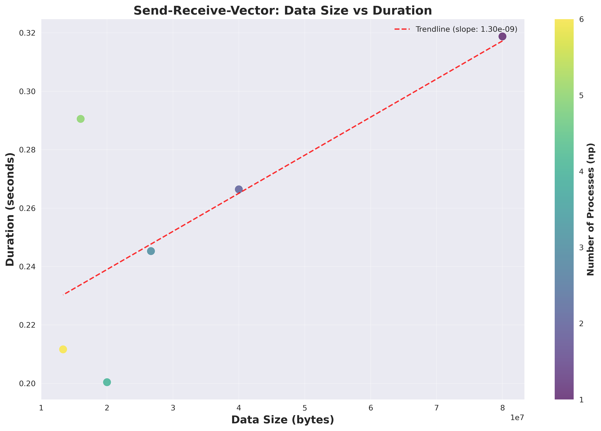
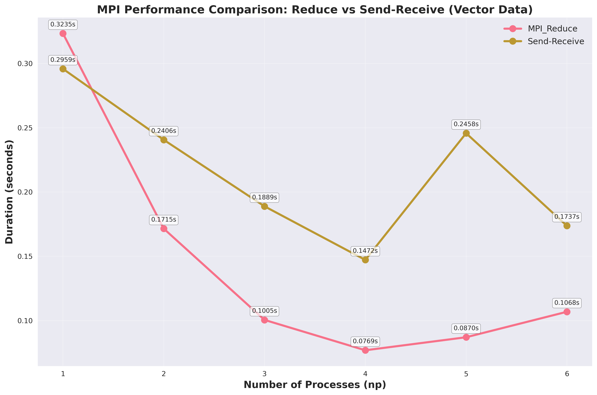

# Performance Analysis Visualizations 📊

## 📁 Dataset & Visualizations

### 📈 1. Comprehensive Analysis

**File:** `comprehensive_analysis.png` (895 KB)  
**Description:** Complete performance analysis overview showing various metrics and comparisons across different experimental setups and parameters.

---

### 📊 2. Data Size vs Duration

**File:** `data_size_vs_duration.png` (216 KB)  
**Description:** Visualizes the relationship between data size and processing duration across different configurations and optimization levels.

---

### ⚡ 3. MPI Vector Detailed Analysis

**File:** `mpi_vector_detailed.png` (357 KB)  
**Description:** Detailed breakdown of MPI vector operations, showing communication patterns, computation phases, and performance characteristics.

---

### 🚀 4. MPI Vector Performance

**File:** `mpi_vector_performance.png` (554 KB)  
**Description:** Overall performance metrics for MPI vector operations including scalability analysis and efficiency measurements.

---

### 📊 5. Simple Bar Charts

**File:** `simple_bar_charts.png` (186 KB)  
**Description:** Comparative bar charts showing basic performance metrics across different experimental conditions.

---

## 📋 File Details

| File | Size | Last Modified | Format |
|------|------|---------------|---------|
| `comprehensive_analysis.png` | 895 KB | Dec 1 10:06 | PNG |
| `data_size_vs_duration.png` | 216 KB | Dec 1 07:24 | PNG |
| `mpi_vector_detailed.png` | 357 KB | Dec 1 08:43 | PNG |
| `mpi_vector_performance.png` | 554 KB | Dec 1 10:21 | PNG |
| `simple_bar_charts.png` | 186 KB | Dec 1 10:06 | PNG |

---

## 🔧 Technical Specifications
- **Format:** All images are in PNG format (Portable Network Graphics)
- **Resolution:** High-resolution for detailed analysis
- **Color Space:** RGB with transparency support where applicable
- **Viewing:** Compatible with any modern image viewer or browser

---

## 📝 Usage Notes
1. Click on any image to view in full size
2. All visualizations are generated from performance benchmarking data
3. Images are optimized for both screen viewing and printing
4. Recommended viewing software:
   - Web browsers (Chrome, Firefox, Safari)
   - Image viewers (feh, eog, IrfanView)
   - Documentation tools (Markdown editors, LaTeX documents)

---

## 📊 Data Source
These visualizations were generated from performance experiments conducted on **December 1, 2024** using:
- MPI (Message Passing Interface) implementations
- High-performance computing clusters
- Various data sizes and processor configurations

---

*Last updated: December 3, 2024*